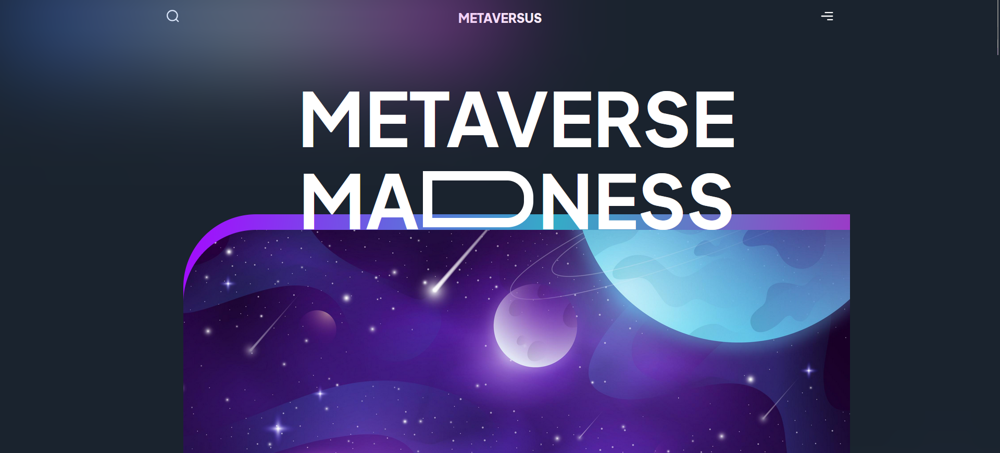

<h1 align="center">Metaversus</h1>

<h2 align="center">Modern UI/UX website</h2>

<br />

  <h3 align="center"><a href="https://metaversus.masoudmaleki.com"><strong>« Try Live Site »</strong></a></h3>


<br/>

## Technologies

<p align="center">
    
    
    
    
    
    
    

</p>

## Pages

- About Metaversus
- The World
- How Metaversus Works
- Whats new?
- People on the World
- Insight

  <br />

## Quick Start

```shell
$ git clone https://github.com/masoudm93/Metaversus.git
$ cd Metaversus
$ npm install
```

### Launch the app

Use the following command to run the app in your localhost.

```
npm run dev
```

## Contact

Feel free to contact me with the following links.

[](https://www.linkedin.com/in/masoud-maleki-891483218/)
[](https://masoudmaleki.com)
[](https://github.com/masoudm93)
